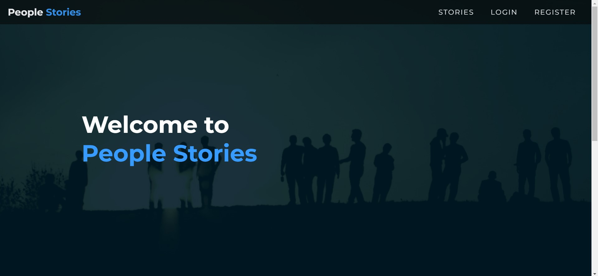
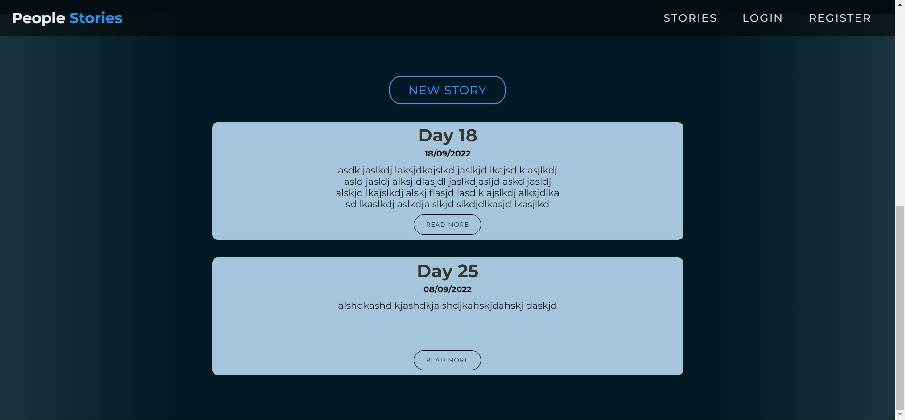
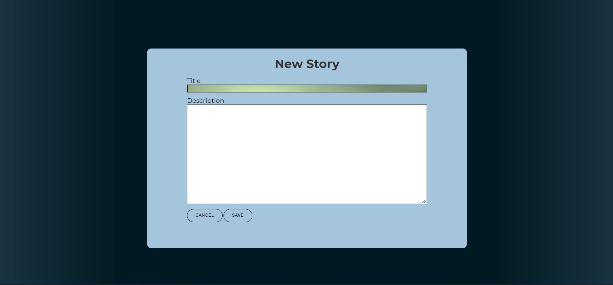
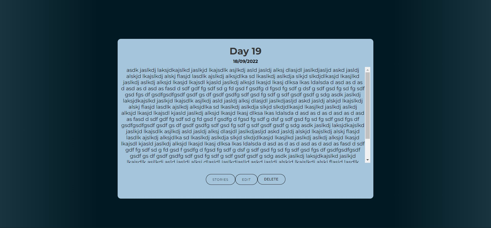
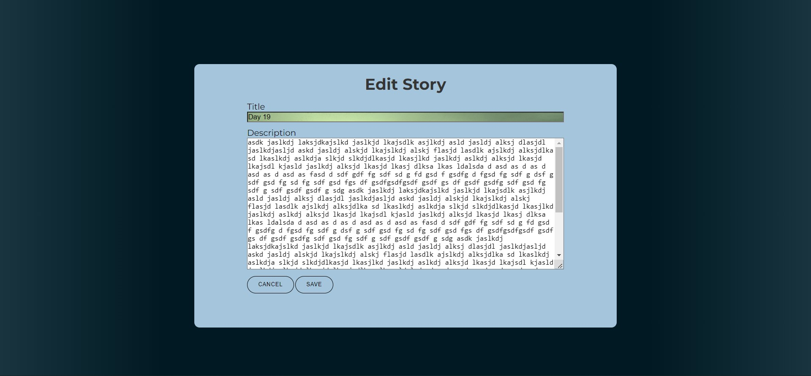
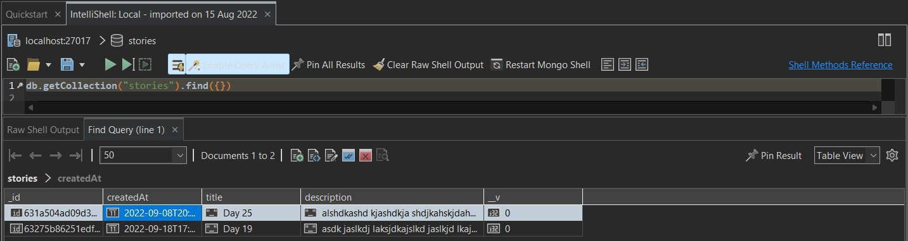

# People Stories Application

### Link to the website
(https://people-stories-assignment.herokuapp.com/)

### Link to Github Repository
(https://github.com/zeringer/PeopleStories)

## Introduction

This project has been done based on the example idea from the lectures. Originally, the main plan was to create
a story telling website similar to blog example, but this time users can register and then log in. Furthermore, being logged in to be able to write stories, edit or delete them.

## System Overview

Unfortunately, heroku does not work for this project for unknown reasons, I was not very familiar with the heroku hosting service itself, so when faced an issue could not really solve it even after a while of doing reseach about the problem. The website is hosted, but does not start giving an "Application Error". If the website being run on a local server we are getting into index main page. Here you can see menu, title over background and a little down the page stories.

On this page user can only navigate by pressing on the branding in the menu section to comeback to front and stories option to go thorugh the stories. Registration and login is not functional due having very short of time

If user presses on the new story button above the stories gets into another "new.ejs" page to create a new story. Then user is able to enter the Title and Description of the story. Timestamp is being added automatically based on the user's computers date settings.

If the story is long enough that does not fit in the story box container, user can press read more button, to be able to read the story fully and if story is still longer than the box container user able to scroll down. Also, on this page another 3 buttons are available for the user which are "STORIES", "EDIT" and "DELETE" story.

If user selects edit option, the story contents being written in the boxes, so user can see the title and the whole story itself and also to edit whatever he desires. After editing is complete, user simply can press on save to save or cancel to cancel and get back to readmore page, but if user presses delete button, story is being deleted instantly.

## Key Design Decisions

 1. The app has been created by using EJS, CSS and JavaScript
 2. Desired "One Page" style story telling web application, but CRUD elements using other pages.
 3. Login/Register is not implemented, originally wanted to prompt the user first to register or login then to get in to the website itself to be able to create, edit or delete stories.

## Database Design

Database has one collection stories, which columns are id (PRIMARY KEY), createdAt (For a date stamp), title and description.

### Entity-Relationship diagram

There is no relationship between the entities, so please refer to the database picture above to understand what is available.

### Difference between SQL and NoSQL

The five critical differences between SQL vs NoSQL are:

1. SQL databases are relational, NoSQL databases are non-relational.
2. SQL databases use structured query language and have a predefined schema. NoSQL databases have dynamic schemas for unstructured data.
3. SQL databases are vertically scalable, while NoSQL databases are horizontally scalable.
4. SQL databases are table-based, while NoSQL databases are document, key-value, graph, or wide-column stores.
5. SQL databases are better for multi-row transactions, while NoSQL is better for unstructured data like documents or JSON.

## Conclusion and Reflection
People Stories application challanged me in every way, because I was not familiar with neither node.js, neither express and mongoDB. This assignment really required me to research a lot of various concepts and to pick the ones i need to apply into my personal work.

I created this project a year ago for other module and fully modified to this prototype for completely different problem solution. I do think i learned quite a lot from this module, but I see how much I can potentially develop my knowledge even further if getting into this deeper and deeper.

I have tried to connect my mongoDB to Atlas, but could not get it there in time. I know, that I have done that on the lectures, but due to lack of time could not apply everything on my project. I know that there is no space for excuses, but I had toughest month in my life due to child on the way, moved house and other assignments.

Finally, I want to say this project still pushed me so hard to do my best I could in the least time manner. I know, It is not great and I know that I can do better, but hoping get further the studies and catch up when the better time come up.